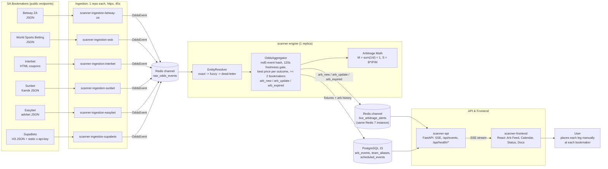
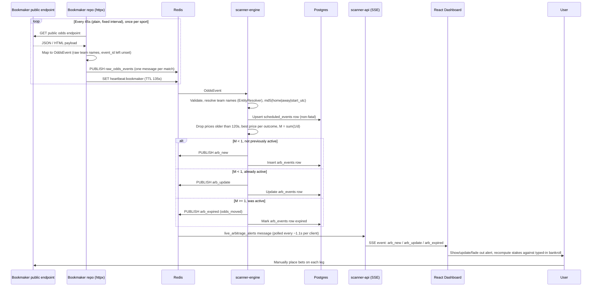
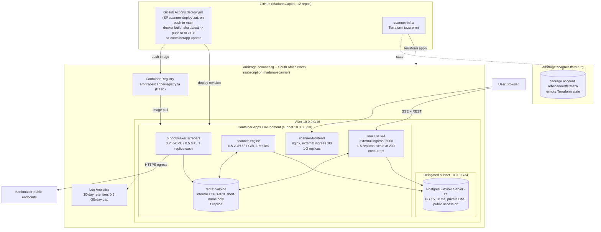
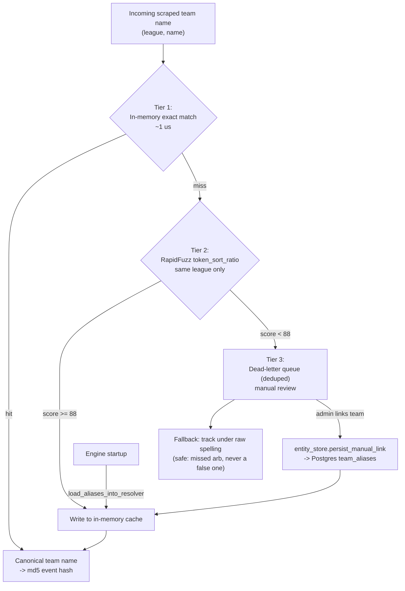
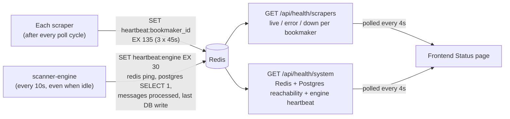
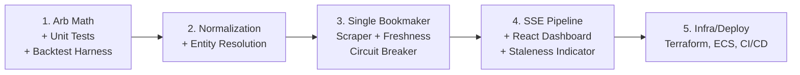

# Architecture Diagrams — MadunaCapital Arbitrage Scanner

Reflects the **as-built** system (see [as-built-architecture.md](as-built-architecture.md)) as of 2026-10-05 — not the original brainstorm in [arbitrage-scanner-plan.md](arbitrage-scanner-plan.md), which assumed anti-bot evasion and AWS; neither turned out to be what was actually needed or used. Renders natively on GitHub; for a standalone browser view see `architecture-diagrams.html` in this same folder. An animated, interactive version lives in the dashboard's Docs page (`scanner-frontend/src/components/docs/`).

## 1. System Architecture (End-to-End Data Flow)

## 2. Scrape-to-Alert Lifecycle (Sequence)

## 3. Azure Infrastructure (South Africa North)

## 4. Entity Resolution — Three-Tier Matching Pipeline

**Status:** wired into OddsAggregator.ingest() for both team names (closed 2026-09-28). team_aliases is only populated via manual links today -- there is no admin UI for the dead-letter queue yet, so unresolved names are tracked under their raw spelling until someone links them.

## 5. Health Monitoring — Heartbeats

**Status:** a missing/expired key is the 'down' signal -- no separate liveness checker exists or is needed.

## 6. Original Build Order (Historical)

This was the plan going in. Actual work followed a similar shape but diverged in the details -- notably, bookmaker integration turned out not to need the stealth/Cloudflare tooling this roadmap assumed, infra moved from AWS/ECS to Azure Container Apps, and a database layer, health monitoring and four more bookmakers were added as later milestones.

