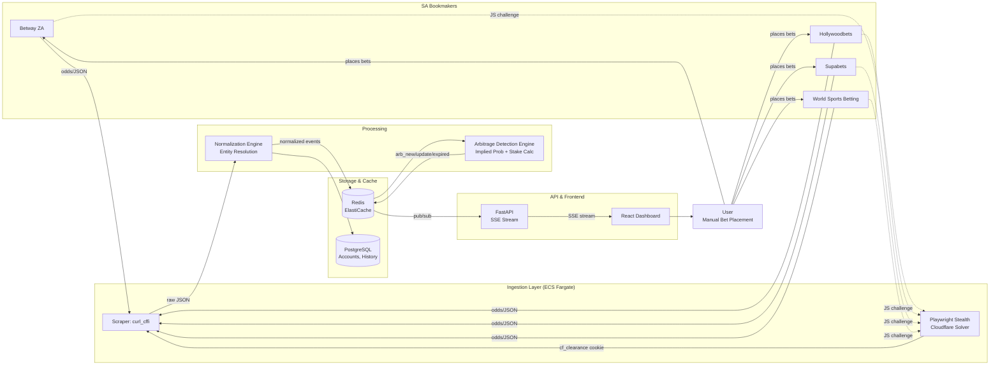
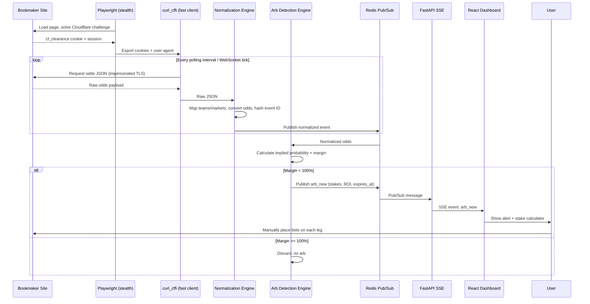
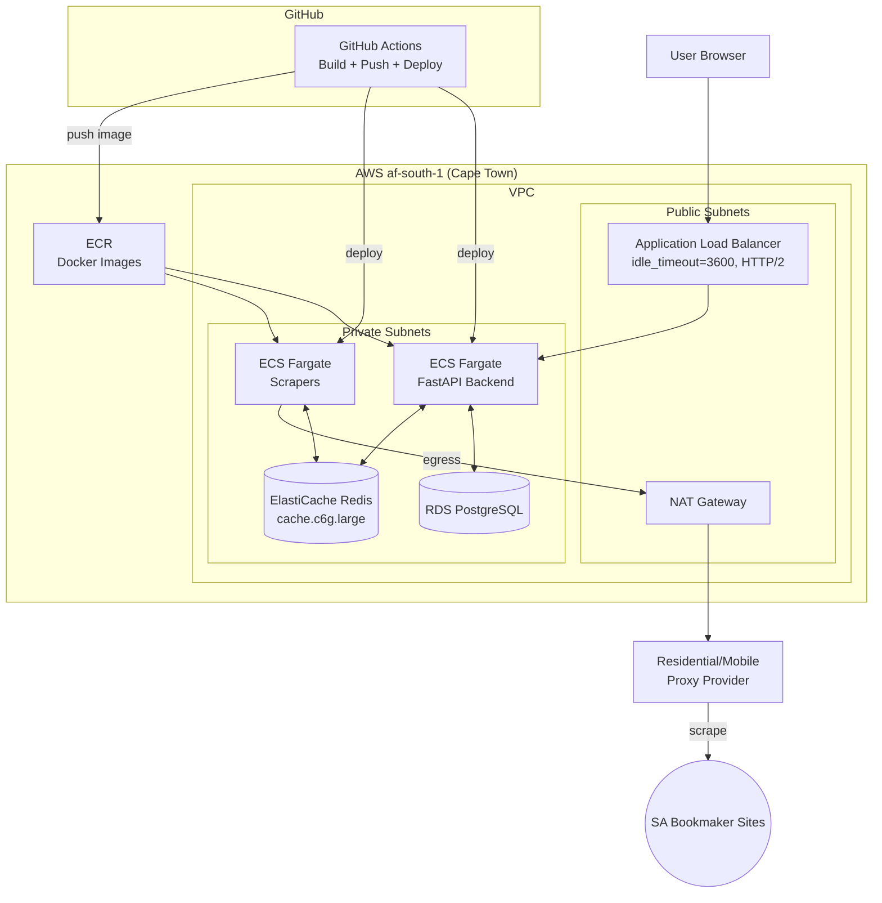
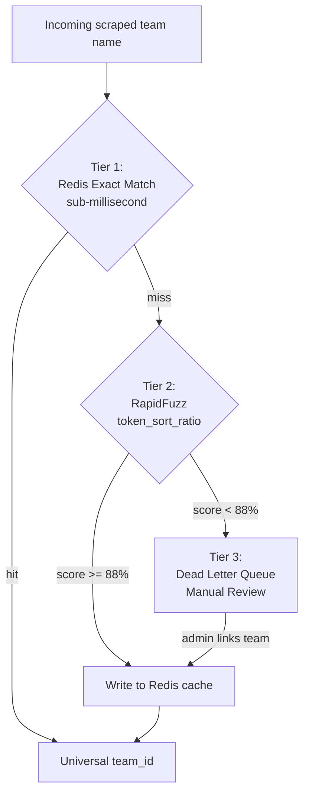
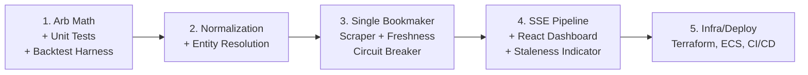

# Architecture Diagrams — MadunaCapital Arbitrage Scanner

Companion diagrams for [arbitrage-scanner-plan.md](arbitrage-scanner-plan.md). Renders natively on GitHub; for a standalone browser view see `architecture-diagrams.html` in this same folder.

## 1. System Architecture (End-to-End Data Flow)

## 2. Scrape-to-Alert Lifecycle (Sequence)

## 3. AWS Infrastructure (af-south-1)

## 4. Entity Resolution — Three-Tier Matching Pipeline

## 5. Suggested Build Order (Roadmap)

