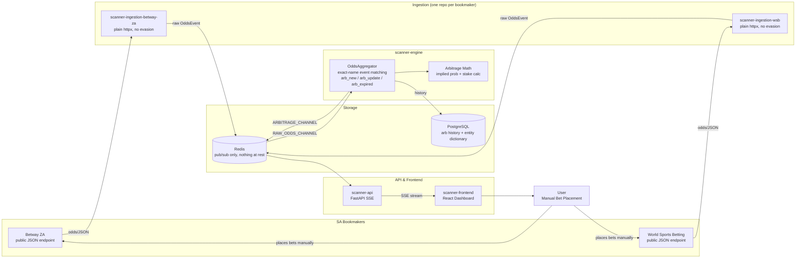
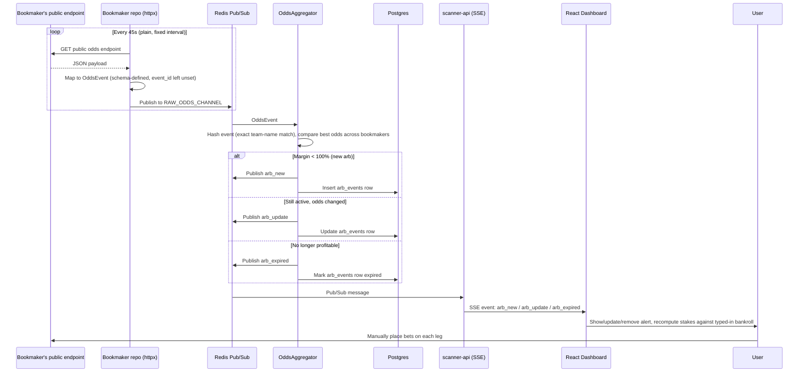
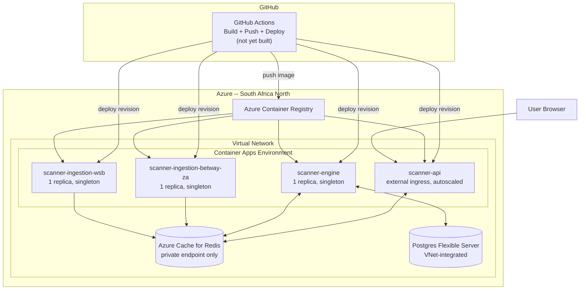
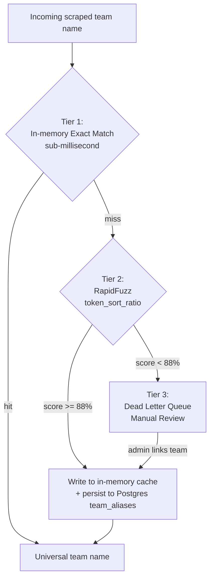
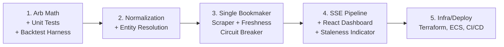

# Architecture Diagrams — MadunaCapital Arbitrage Scanner

Reflects the **as-built** system (see [as-built-architecture.md](as-built-architecture.md)) — not the original brainstorm in [arbitrage-scanner-plan.md](arbitrage-scanner-plan.md), which assumed anti-bot evasion and AWS; neither turned out to be what was actually needed or used. Renders natively on GitHub; for a standalone browser view see `architecture-diagrams.html` in this same folder.

## 1. System Architecture (End-to-End Data Flow)

## 2. Scrape-to-Alert Lifecycle (Sequence)

## 3. Azure Infrastructure (South Africa North)

## 4. Entity Resolution — Three-Tier Matching Pipeline

**Status:** built and tested (`normalization.py`, `entity_store.py`), but **not yet called by `aggregator.py`** — event matching across bookmakers is exact-name-only today. See as-built-architecture.md's "Known gap" section.

## 5. Original Build Order (Historical)

This was the plan going in. Actual work followed a similar shape but diverged in the details — notably, bookmaker integration turned out not to need the stealth/Cloudflare tooling this roadmap assumed, and a database layer + full Azure infra were added as later, separate milestones once 2 bookmakers were working. See as-built-architecture.md for what's actually true today.

